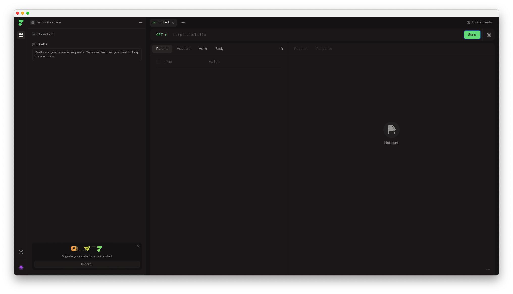

<h4 align="right"><strong><a href="https://github.com/XieWeiXie/PPack"></a></strong>简体中文</h4>
<h1 align="center">PPack</h1>
<p align="center"><strong>用 Go 打包网页生成 Mac 桌面 应用</strong></p>
<p align="left"><strong>原理：使用 webview 将目标网页打包成可执行文件，再根据 Mac 应用的构成，设置对应的图标和应用说明，打包成 dmg 格式的文件</strong></p>


## 特征

- 小，非常小，足够小
- 快，非常快，足够快
- 简单，非常简单，足够简单

<body>
<table align="left">
    <tr align="left">
        <th> APP </th>
        <th> SIZE </th>
        <th> LINK</th>
    </tr>
    <tr align="left">
        <td> WeRead </td>
        <td> 1.9 MB </td>
        <td> <a href="https://github.com/XieWeiXie/PPack/releases/download/v1.0.0/WEREAD.dmg"> WeRead.dmg </a></td>
    </tr>
    <tr align="left">
        <td> DouYin </td>
        <td> 2.6 MB </td>
        <td> <a href="https://github.com/XieWeiXie/PPack/releases/download/v1.0.0/DOUYIN.dmg"> DouYin.dmg </a></td>
    </tr>
    <tr align="left">
        <td> Typst </td>
        <td> 1.9 MB </td>
        <td> <a href="https://github.com/XieWeiXie/PPack/releases/download/v1.0.0/TYPST.dmg"> Typst.dmg </a></td>
    </tr>
    <tr align="left">
        <td> XiaoHongShu </td>
        <td> 1.9 MB </td>
        <td> <a href="https://github.com/XieWeiXie/PPack/releases/download/v1.0.0/XIAOHONGSHU.dmg"> XiaoHongShu.dmg </a></td>
    </tr>
    <tr>
        <td> RaySo </td>
        <td> 2 MB </td>
        <td> <a href="https://github.com/XieWeiXie/PPack/releases/download/v1.0.0/RAYSO.dmg" > RaySo.dmg </a>  </td>
    </tr>
    <tr>
        <td> ChatGPT </td>
        <td> 2.3 MB </td>
        <td> <a href="https://github.com/XieWeiXie/PPack/releases/download/v1.0.0/CHATGPT.dmg" > ChatGPT.dmg </a>  </td>
    </tr>
    <tr>
        <td> Godoc </td>
        <td> 1.9 MB </td>
        <td> <a href="https://github.com/XieWeiXie/PPack/releases/download/v1.0.0/GoDoc.dmg" > Godoc.dmg </a>  </td>
    </tr>
    <tr>
        <td> Httpie </td>
        <td> 1.8 MB </td>
        <td> <a href="https://github.com/XieWeiXie/PPack/releases/download/v1.0.0/HTTPIE.dmg" > HTTPIE.dmg </a>  </td>
    </tr>
</table>
</body>


<br/>
<br/>
<br/>
<br/>
<br/>
<br/>
<br/>
<br/>
<br/>
<br/>
<br/>
<br/>


## 使用

```shell

make app URL=https://weread.qq.com/ APP_NAME=weread ICON_NAME=weread.icns

make app URL=https://www.xiaohongshu.com/ APP_NAME=xiaohongshu ICON_NAME=xiaohongshu.icns

make app URL=https://typst.app/ APP_NAME=typst ICON_NAME=typst.icns

make app URL=https://www.douyin.com/ APP_NAME=douyin ICON_NAME=app.icns

make app URL=https://ray.so/ APP_NAME=rayso ICON_NAME=raycast.icns

make app URL=https://chat.openai.com/ APP_NAME=chatgpt ICON_NAME=chatgpt.icns

make app URL=https://weibo.com/ APP_NAME=weibo ICON_NAME=weibo.png
```

- URL 目标网站
- APP_NAME 应用名称
- ICON_NAME 应用图标


## 图标

- [iconFinder](https://www.iconfinder.com/)
- [macosIcons](https://macosicons.com/#/)

## 自制图标

- [Bakery - Simple Icon Creator](https://apps.apple.com/us/app/bakery-simple-icon-creator/id1575220747?mt=12)


## 示例

<h4 > 常见打包示例 </h4>
<p align="left"> <a href="https://weread.qq.com/"> WeRead </a>
<br>
<br>

</p>

<p align="left"> <a href="https://www.douyin.com/"> DouYin </a>
<br>
<br>

</p>


<p align="left"> <a href="https://typst.app/"> Typst </a>
<br>
<br>

</p>

<p align="left"> <a href="https://www.xiaohongshu.com/"> XiaoHongShu </a>
<br>
<br>

</p>

<p align="left"> <a href="https://ray.so/" > RaySo </a>
<br>
<br>

</p>

<p align="left"> <a href="https://chat.openai.com/" > ChatGPT </a>
<br>
<br>

</p>


<p align="left"> <a href=https://pkg.go.dev/" > Godoc </a>
<br>
<br>

</p>


<p align="left"> <a href=https://httpie.io/app" > Httpie </a>
<br>
<br>

</p>
